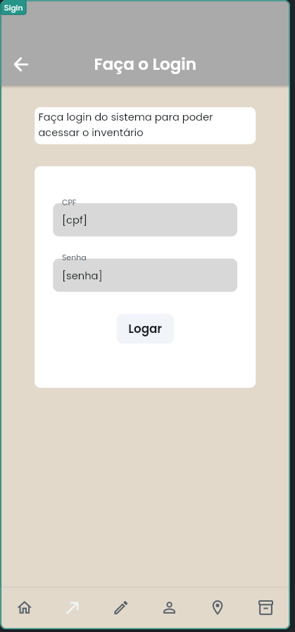
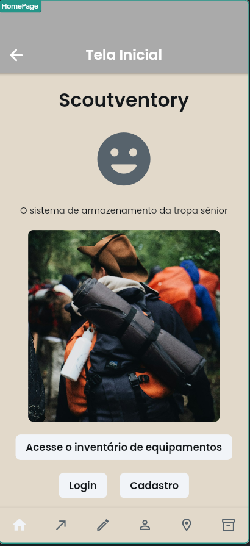

# Atividade-Individual-08-12-2025

---

## Sistema

"Scoutventory, o sistema de inventário da tropa sênior."

Projeto da UC Desenvolvimento de Aplicativos Móveis 2º Semestre de 2025 no Senai utilizando FLutter Flow e API com Java Spring Boot. A atividade tem somente fins pedagógicos, com foco em aprender a integração da API com as Telas do FlutterFlow.

---

### Descrição das funcionalidades

O projeto permite a realizações de ações do usuário através da interface gráfica do FlutterFlow através do formato Json. 
O sistema permite o Cadastro e Login dos usuários. O sistema permite o cadastro do endereço.

---

### Tecnologias utilizadas

- Java
- FlutterFlow
- Swagger
- Render
- Maven
- Spring Boot
- Google Docs
- GitHub
- VSCode
- PostgressSQL

---

### Link do Deploy no Swagger

Link: https://trabalho-senai-u6cz.onrender.com/aula/swagger-ui/index.html?authuser=2#/

---

### Link da Documentação no Google Docs

Link: https://docs.google.com/document/d/1lGVzK9ptHGkVhRfvVuo1WsGa1dS_Q-JHYFHVc0stfsM/edit?usp=sharing

---

### Telas no FlutterFlow

Tela de Login (Sigin)
Tela de Cadastro (Register)
Tela de DadosDoUsuario (User)
Tela de Inicial (HomePage)
Tela de Inventário (Inventario)
Tela do produto Saco de Dormir (PSacoDeDormir)
Tela de cadastro do Endereço (Address)

| Login (`sigin`) | Cadastro (`register`) | DadosDoUsuario (`user`) |
| :---: | :---: | :---: |
|  |  |  |

| HomePage (`homepage`) | Inventário (`inventory`) | SacoDeDormir (`psacodedormir`) | Endereço (`address`) |
| :---: | :---: | :---: | :---: |
|  |  |  |  |

---

### Desenvolvedor

Nicolas Esteves Caetano Moreira
